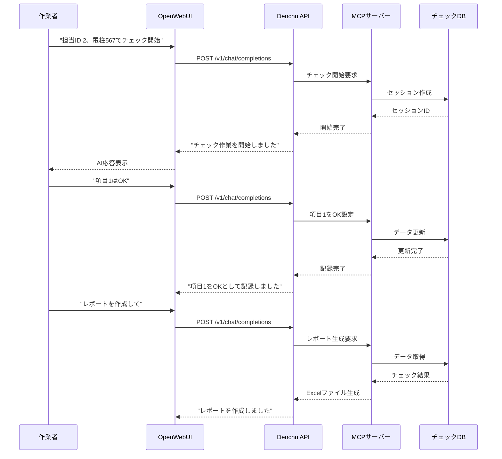

# Denchu Interactive Server

電柱チェック業務向けの対話型LangChainサーバーです。OpenWebUIと連携し、MCPサーバーを通じて実際の業務ツールと統合された、実用的なAIアシスタントを提供します。

## 🎯 目的

- **実業務対応**: 電柱保守・点検業務の効率化
- **対話型インターフェイス**: OpenWebUIによる直感的な操作
- **ツール統合**: MCPサーバー経由での外部システム連携
- **リアルタイム処理**: ユーザーとの動的な対話に対応

## 🏗️ システム構成

```
OpenWebUI → FastAPI → LangChain Agent → MCP Server → Business Tools
   ↓           ↓           ↓              ↓           ↓
 Web UI  → REST API → ReAct Agent → Java Tools → Checklist DB
```

## ✨ 主要機能

### 🤖 AI エージェント機能
- ✅ **ReAct Pattern**: 推論-行動-観察サイクルによる動的処理
- ✅ **マルチツール**: 複数のMCPサーバーとの並行連携
- ✅ **状況判断**: コンテキストに応じた適切なアクション選択
- ✅ **エラー復旧**: 失敗時の自動リトライと代替手段

### 📋 電柱チェック業務
- ✅ **チェックリスト管理**: 項目別のOK/NG判定
- ✅ **進捗追跡**: リアルタイムでの作業状況確認
- ✅ **レポート生成**: Excel形式での結果出力
- ✅ **備考管理**: 詳細情報の記録と参照

### 🌐 Web API
- ✅ **OpenAI互換**: `/v1/chat/completions` エンドポイント
- ✅ **モデル情報**: `/v1/models` エンドポイント
- ✅ **非同期処理**: 高性能な並行リクエスト処理
- ✅ **エラーハンドリング**: 堅牢なエラー処理と適切なレスポンス

## 🚀 クイックスタート

### 1. 前提条件

```bash
# LLMエンジンの起動
ollama serve
ollama pull qwen3:14b

# Java環境の確認（MCPサーバー用）
java --version
```

### 2. サーバー起動

```bash
# 基本起動
cd langchain_server/denchu
python app.py

# カスタム設定で起動
python app.py custom_config.json
```

### 3. OpenWebUIとの連携

```bash
# OpenWebUIの起動（別ターミナル）
cd openwebui-docker
docker-compose up -d

# ブラウザでアクセス
open http://localhost:3000
```

### 4. API設定

OpenWebUIの設定画面で：
- **API Base URL**: `http://localhost:8000`
- **API Key**: `EMPTY`（ローカル環境）

## ⚙️ 設定ファイル

### app.json の詳細設定

```json
{
    "openai_api_base": "http://localhost:11434/v1",
    "agent_model": "qwen3:14b",
    "log_folder": "logs",
    "report_folder": "out",
    "system_prompts": [
        "あなたはMCPサーバーを使用するAIアシスタントです。",
        "MCP Toolの結果を優先して回答として採用してください。",
        "開始時には、担当IDと電柱IDを必ず確認してください。",
        "チェック項目のOK/NGの更新指示があった場合はMCP Toolを使って更新してください。",
        "回答は表や段組みなどを使わず、読み上げることができる短い日本語で書いてください。"
    ],
    "color": {
        "tool": "32",     # MCPツール（緑）
        "system": "36",   # システム（シアン）
        "agent": "93",    # AI応答（明るい黄）
        "user": "91"      # ユーザー（明るい赤）
    },
    "mcp_servers": {
        "checklist": {
            "transport": "stdio",
            "command": "java",
            "args": [
                "-Xms64m",
                "-Xmx128m",
                "-jar",
                "./sandbox-mcp-checklist-0.0.1-SNAPSHOT-all.jar",
                "--type", "3",
                "-c", "tcp://localhost:12345"
            ]
        }
    }
}
```

### 重要な設定項目

#### LLMモデル設定
```json
{
    "openai_api_base": "http://localhost:11434/v1",  // Ollama API
    "agent_model": "qwen3:14b"                       // 使用モデル
}
```

#### システムプロンプト
業務特化のプロンプトエンジニアリング：
```json
{
    "system_prompts": [
        "あなたはMCPサーバーを使用するAIアシスタントです。",
        "開始時には、担当IDと電柱IDを必ず確認してください。",
        "チェック項目のOK/NGの更新指示があった場合はMCP Toolを使って更新してください。"
    ]
}
```

#### MCPサーバー設定
```json
{
    "mcp_servers": {
        "checklist": {                    // サーバー識別名
            "transport": "stdio",         // 通信方式
            "command": "java",            // 実行コマンド
            "args": [                     // 引数配列
                "-jar", "./tool.jar",
                "--type", "3"
            ]
        }
    }
}
```

## 📡 API仕様

### チャット補完エンドポイント

```http
POST /v1/chat/completions
Content-Type: application/json

{
    "model": "qwen3:14b",
    "messages": [
        {
            "role": "user",
            "content": "担当ID 5、電柱 789 でチェック開始"
        }
    ]
}
```

**レスポンス例:**
```json
{
    "id": "chatcmpl-abc12345",
    "object": "chat.completion",
    "created": 1698765432,
    "model": "qwen3:14b",
    "choices": [
        {
            "index": 0,
            "message": {
                "role": "assistant",
                "content": "担当ID 5、電柱ID 789でチェック作業を開始します。チェックリストを準備しました。どの項目から確認しますか？"
            },
            "finish_reason": "stop"
        }
    ],
    "usage": {
        "prompt_tokens": 45,
        "completion_tokens": 67,
        "total_tokens": 112
    }
}
```

### モデル一覧エンドポイント

```http
GET /v1/models
```

```json
{
    "data": [
        {
            "id": "nautilus-llm",
            "object": "model"
        }
    ]
}
```

## 💼 業務ワークフロー

### 標準的な電柱チェック手順



### 実際の対話例

```
👤 作業者: "担当ID 2、電柱567でチェック開始"
🤖 AI: "担当ID 2、電柱ID 567でチェック作業を開始します。チェックリストを準備しました。"

👤 作業者: "1番はOK"
🤖 AI: "項目1をOKとして記録しました。次の項目をお知らせください。"

👤 作業者: "2番も問題なし"
🤖 AI: "項目2もOKとして記録しました。"

👤 作業者: "10番は古くなってるのでNG"
🤖 AI: "項目10をNGとして記録し、備考に「古い」を追加しました。修理が必要ですね。"

👤 作業者: "進捗確認"
🤖 AI: "現在の進捗: 完了 3項目、OK 2項目、NG 1項目。残り項目を確認しますか？"

👤 作業者: "他は全部OK"
🤖 AI: "残りの項目をすべてOKとして記録しました。チェック作業完了です。"

👤 作業者: "レポート作成"
🤖 AI: "チェック結果レポートを作成しました。ファイル名: checklist-result-20251027-1445.xlsx"
```

## 🛠️ カスタマイズ

### 1. 業務特化プロンプトの調整

```json
{
    "system_prompts": [
        "あなたは建設現場のAIアシスタントです。",
        "安全第一で作業指示を行ってください。",
        "異常を発見した場合は即座に報告してください。"
    ]
}
```

### 2. 独自MCPサーバーの追加

```json
{
    "mcp_servers": {
        "checklist": { /* 既存設定 */ },
        "maintenance": {
            "transport": "stdio",
            "command": "python",
            "args": ["maintenance_server.py"]
        },
        "notification": {
            "transport": "tcp",
            "host": "localhost",
            "port": 8081
        }
    }
}
```

### 3. カスタムレスポンス処理

```python
# app.py内で追加
async def custom_response_handler(result):
    """カスタムレスポンス処理"""
    if "緊急" in result or "危険" in result:
        # 緊急時の特別処理
        await send_emergency_notification(result)
    
    return result
```

## 📊 監視とメトリクス

### ログ分析

```python
# logs/ ディレクトリ内のログファイル分析
import re
from collections import Counter

def analyze_logs():
    with open('logs/mcp_ex_text.20251027-1400.log') as f:
        logs = f.read()
    
    # エラー頻度
    errors = re.findall(r'ERROR.*', logs)
    error_count = len(errors)
    
    # 処理時間分析
    times = re.findall(r'所要時間:(\d+:\d+:\d+)', logs)
    avg_time = calculate_average_time(times)
    
    return {
        'error_count': error_count,
        'average_time': avg_time
    }
```

### パフォーマンス監視

```bash
# リソース使用量監視
top -p $(pgrep -f "python app.py")

# API応答時間測定
curl -w "@curl-format.txt" \
     -X POST "http://localhost:8000/v1/chat/completions" \
     -H "Content-Type: application/json" \
     -d '{"messages":[{"role":"user","content":"テスト"}]}'
```

## 🔧 開発者向け情報

### アーキテクチャ設計

```python
# 非同期初期化パターン
async def initialize_components():
    global agent, tools, llm
    
    # MCPクライアント初期化
    client = MultiServerMCPClient(mcp_config)
    tools = await client.get_tools()
    
    # ReActエージェント構築
    agent = create_react_agent(
        llm=llm,
        tools=tools,
        state_modifier=system_message,
        store=InMemoryStore()
    )
```

### エラーハンドリング戦略

```python
@app.post("/v1/chat/completions")
async def chat_completions(request: Request):
    try:
        # メイン処理
        result = await agent.ainvoke({"input": prompt})
        return format_response(result)
    
    except MCPConnectionError:
        # MCP接続エラー時の代替処理
        return fallback_response("MCPサーバーに接続できません")
    
    except Exception as e:
        # その他のエラー
        log_error(e)
        return error_response(str(e))
```

### テスト戦略

```python
# tests/test_denchu.py
import pytest
from app import app

@pytest.mark.asyncio
async def test_chat_completion():
    """チャット補完APIのテスト"""
    response = await client.post("/v1/chat/completions", json={
        "messages": [{"role": "user", "content": "テスト"}]
    })
    assert response.status_code == 200
    assert "content" in response.json()["choices"][0]["message"]

@pytest.mark.asyncio 
async def test_mcp_integration():
    """MCP統合のテスト"""
    # MCPサーバーとの連携テスト
    pass
```

## 🐛 トラブルシューティング

### よくある問題と解決方法

#### 1. MCPサーバー接続エラー

**症状**: `MultiServerMCPClient connection failed`
**原因**: JARファイルの不在、Java環境の問題
**解決**:
```bash
# Java環境確認
java --version
echo $JAVA_HOME

# JARファイル確認
ls -la *.jar

# 手動起動テスト
java -jar sandbox-mcp-checklist-0.0.1-SNAPSHOT-all.jar --help
```

#### 2. OpenWebUI連携エラー

**症状**: `Connection refused` または `CORS error`
**原因**: ポート設定、CORS設定の問題
**解決**:
```python
# app.py に CORS設定追加
from fastapi.middleware.cors import CORSMiddleware

app.add_middleware(
    CORSMiddleware,
    allow_origins=["http://localhost:3000"],
    allow_credentials=True,
    allow_methods=["*"],
    allow_headers=["*"],
)
```

#### 3. メモリ不足エラー

**症状**: `OutOfMemoryError` または応答遅延
**原因**: LLMモデルサイズ、メモリ不足
**解決**:
```bash
# より軽量なモデルに変更
ollama pull qwen3:8b  # 14b → 8b

# Javaヒープサイズ調整
"args": ["-Xms32m", "-Xmx64m", "-jar", "..."]
```

#### 4. レスポンス形式エラー

**症状**: `'dict' object has no attribute 'find'`
**原因**: OpenWebUI互換性の問題
**解決**: [修正済み] 適切なJSON形式でレスポンス

## 📁 ファイル構成

```
denchu/
├── app.py                              # メインサーバーアプリケーション
├── app.json                            # 設定ファイル
├── logs/                              # ログディレクトリ
│   └── mcp_ex_text.YYYYMMDD-HHMM.log  # 実行ログ
└── README.md                          # このファイル

外部依存:
├── sandbox-mcp-checklist-*.jar        # MCPサーバー（Java）
└── out/                              # レポート出力ディレクトリ
```

## 🔗 関連プロジェクト

| プロジェクト | 用途 | 特徴 |
|--------------|------|------|
| **[Simple](../simple/README.md)** | 学習・プロトタイプ | 最小構成、MCP無し |
| **[Denchu Auto](../denchu_auto/README.md)** | 自動化・バッチ | UI無し、事前定義実行 |
| **[MCP Blend](../mcp_blend/README.md)** | MCP統合サンプル | 複数MCP、実験的 |
| **[メインプロジェクト](../../README.md)** | 全体管理 | アーキテクチャ全体 |

## 📈 パフォーマンス

### ベンチマーク結果

| モデル | 初期化時間 | 応答時間 | メモリ使用量 | 同時接続数 |
|--------|-----------|----------|--------------|------------|
| qwen3:8b | 10-15秒 | 2-5秒 | 6GB | 5-10 |
| qwen3:14b | 15-25秒 | 3-8秒 | 10GB | 3-8 |
| qwen3:32b | 30-45秒 | 5-15秒 | 20GB | 1-3 |

### 推奨システム構成

**開発環境:**
- CPU: 4コア以上
- RAM: 16GB以上
- SSD: 50GB以上

**本番環境:**
- CPU: 8コア以上
- RAM: 32GB以上
- SSD: 100GB以上
- ネットワーク: 1Gbps以上

## 🚀 将来の機能拡張

### 短期目標（1-3ヶ月）
- [ ] 音声入力対応（Whisper統合）
- [ ] 画像認識機能（電柱写真解析）
- [ ] モバイルアプリ対応
- [ ] オフライン動作モード

### 中期目標（3-12ヶ月）
- [ ] クラウド展開（AWS/GCP）
- [ ] マルチテナント対応
- [ ] 高可用性構成
- [ ] API Rate Limiting

### 長期目標（1年以上）
- [ ] AI モデルのファインチューニング
- [ ] 予測保全機能
- [ ] IoTセンサー統合
- [ ] ブロックチェーン記録

---

**最終更新**: 2025年10月27日  
**バージョン**: 1.0.0  
**作成者**: SugioNakazawa