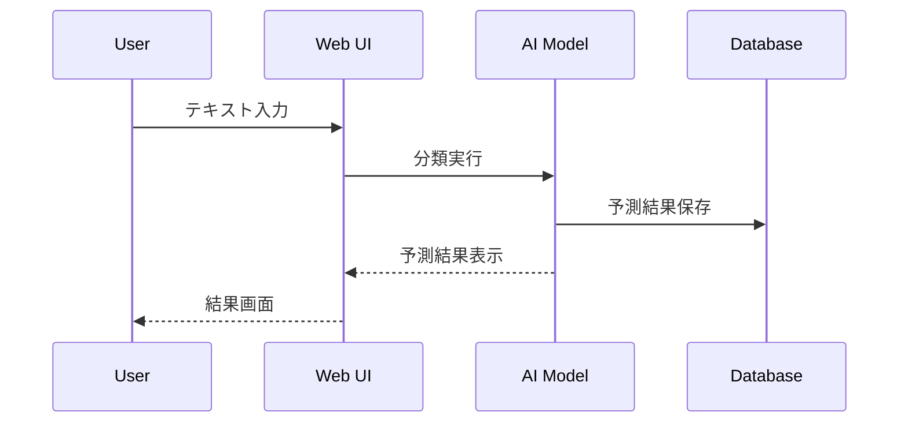
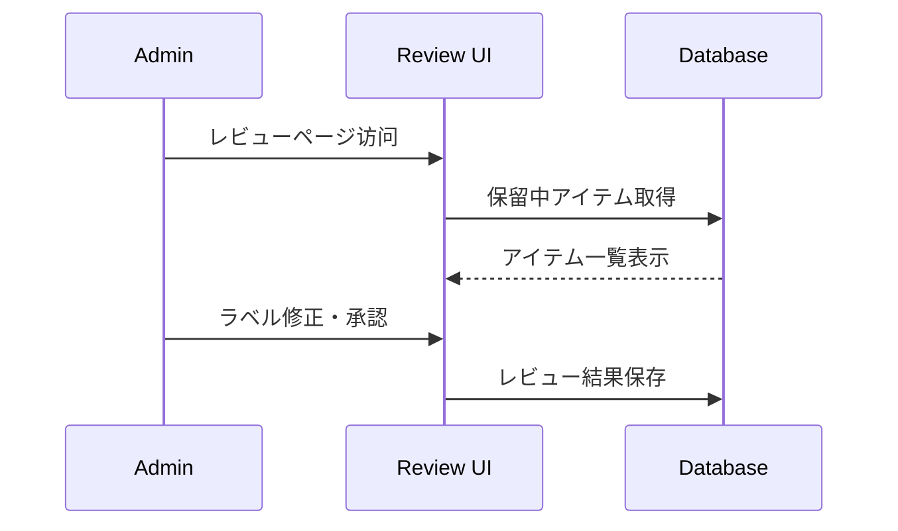

# Human-in-the-Loop (HITL) Demo

Human-in-the-Loop機械学習のワークフローを示すFastAPIベースのデモアプリケーションです。AIモデルの予測結果に対して人間が監督・修正を行い、その結果を使ってモデルを継続的に改善していく仕組みを実装しています。

## 🎯 目的

- **HITL概念の実装**: 人間とAIの協働による機械学習パイプラインの構築
- **継続学習**: ユーザーフィードバックを活用した動的なモデル改善
- **品質管理**: AIの予測結果に対する人間による監査・修正
- **教育デモ**: HITLワークフローの理解促進

## 🏗️ システム構成

```
User Input → AI Prediction → Human Review → Model Improvement
    ↓             ↓              ↓              ↓
テキスト送信 → 自動分類 → 人間による検証 → モデル再学習
```

## ✨ 主要機能

### 🤖 AI予測システム
- ✅ **テキスト分類**: 入力されたテキストの自動分類
- ✅ **予測保存**: 全ての予測結果をデータベースに記録
- ✅ **scikit-learn統合**: 機械学習モデルによる予測実行

### 👨‍💼 レビューシステム
- ✅ **管理者インターフェース**: 予測結果の一覧表示・レビュー
- ✅ **ラベル修正**: AIの予測に対する人間による修正
- ✅ **承認・却下**: レビュー結果の記録（accepted/rejected）
- ✅ **履歴管理**: レビュー履歴とタイムスタンプの保持

### 🔄 継続学習
- ✅ **モデル再学習**: レビュー済みデータを使った動的学習
- ✅ **自動更新**: 新しいモデルによる予測精度向上
- ✅ **履歴追跡**: 学習データとモデルバージョンの管理

## 🚀 クイックスタート

### 1. 依存関係のインストール

必要なパッケージは既にプロジェクトの`requirements.txt`に含まれています：

```bash
# プロジェクトルートから
pip install -r requirements.txt
```

主要な依存パッケージ：
- `fastapi` - Webアプリケーションフレームワーク
- `uvicorn` - ASGIサーバー
- `jinja2` - HTMLテンプレートエンジン
- `scikit-learn` - 機械学習ライブラリ
- `python-multipart` - フォーム処理

### 2. アプリケーション起動

```bash
cd langchain_server/human-in-the-loop
python hitl_fastapi_demo.py
```

または

```bash
uvicorn hitl_fastapi_demo:app --reload
```

### 3. アクセス

- **メインページ**: http://127.0.0.1:8000
- **管理レビュー**: http://127.0.0.1:8000/review
- **API**: http://127.0.0.1:8000/items

## 📡 API エンドポイント

### フロントエンド

| エンドポイント | メソッド | 説明 |
|----------------|----------|------|
| `/` | GET | テキスト送信フォーム |
| `/review` | GET | 管理者レビューページ |

### API

| エンドポイント | メソッド | 説明 |
|----------------|----------|------|
| `/submit` | POST | テキスト送信・分類実行 |
| `/items` | GET | 全アイテム一覧（JSON） |
| `/review/{id}` | POST | レビュー結果保存 |
| `/retrain` | POST | モデル再学習実行 |

## 💼 使用ワークフロー

### 1. テキスト送信フェーズ



**実際の操作:**
1. メインページ（`/`）でテキストを入力
2. 「送信」ボタンをクリック
3. AIが自動分類を実行
4. 結果がデータベースに保存（status: pending）

### 2. レビューフェーズ



**実際の操作:**
1. 管理者が `/review` ページにアクセス
2. 保留中（pending）のアイテムを確認
3. AIの予測結果を確認し、必要に応じてラベルを修正
4. 「Accept」または「Reject」を選択
5. レビュー結果がデータベースに保存

### 3. 再学習フェーズ

**実際の操作:**
1. レビューページで「Retrain model」ボタンをクリック
2. レビュー済み（accepted/rejected）データを学習データとして使用
3. 新しいモデルが訓練され、自動的に更新

## 📊 データベーススキーマ

### items テーブル

| カラム | 型 | 説明 |
|--------|----|----- |
| `id` | INTEGER | 主キー（自動採番） |
| `text` | TEXT | 入力テキスト |
| `predicted_label` | TEXT | AIの予測ラベル |
| `true_label` | TEXT | 人間が修正したラベル |
| `status` | TEXT | ステータス（pending/accepted/rejected） |
| `created_at` | TEXT | 作成日時 |
| `reviewed_at` | TEXT | レビュー日時 |

### ステータス遷移

```
pending → accepted (レビューで承認)
pending → rejected (レビューで却下)
```

## 🎨 UI スクリーンショット例

### メインページ（テキスト送信）
- シンプルなテキスト入力フォーム
- 送信ボタン
- レビューページへのリンク

### レビューページ
- 保留中アイテムのテーブル表示
- ラベル修正フィールド
- Accept/Rejectボタン
- モデル再学習ボタン

## 🛠️ カスタマイズ

### 1. 分類モデルの変更

```python
# hitl_fastapi_demo.py の classify_text 関数を修正
def classify_text(text):
    # カスタムモデルの実装
    if "雨" in text or "天気" in text:
        return "weather"
    elif "仕事" in text or "会社" in text:
        return "work" 
    else:
        return "other"
```

### 2. データベースの拡張

```sql
-- 新しいカラムの追加例
ALTER TABLE items ADD COLUMN confidence REAL;
ALTER TABLE items ADD COLUMN user_id TEXT;
ALTER TABLE items ADD COLUMN category TEXT;
```

### 3. UI テンプレートのカスタマイズ

```python
# Jinja2テンプレートのカスタマイズ
REVIEW_TEMPLATE = Template("""
<html>
<head>
    <title>Custom Review Page</title>
    <style>
        /* カスタムCSS */
        .review-table { border-collapse: collapse; }
        .pending { background-color: #fff3cd; }
    </style>
</head>
<!-- カスタムHTMLコンテンツ -->
</html>
""")
```

### 4. 認証の追加

```python
from fastapi import Depends, HTTPException, status
from fastapi.security import HTTPBasic, HTTPBasicCredentials

security = HTTPBasic()

def get_current_user(credentials: HTTPBasicCredentials = Depends(security)):
    # 認証ロジックの実装
    if credentials.username != "admin" or credentials.password != "password":
        raise HTTPException(
            status_code=status.HTTP_401_UNAUTHORIZED,
            detail="Invalid credentials"
        )
    return credentials.username

# レビューエンドポイントに認証を追加
@app.get("/review")
async def review_page(current_user: str = Depends(get_current_user)):
    # レビューページのロジック
    pass
```

## 📈 モニタリング

### メトリクス例

アプリケーション起動時のログから現在の状況を確認：

```
[HITL MON] total=0 pending=0
```

- `total`: 総アイテム数
- `pending`: レビュー待ちアイテム数

### データ品質の監視

```python
# レビュー済みデータの統計
def get_review_stats():
    conn = sqlite3.connect(DB_PATH)
    c = conn.cursor()
    
    # 承認率
    c.execute("SELECT COUNT(*) FROM items WHERE status='accepted'")
    accepted = c.fetchone()[0]
    
    # 却下率  
    c.execute("SELECT COUNT(*) FROM items WHERE status='rejected'")
    rejected = c.fetchone()[0]
    
    total_reviewed = accepted + rejected
    if total_reviewed > 0:
        acceptance_rate = accepted / total_reviewed * 100
        return f"承認率: {acceptance_rate:.1f}%"
    
    return "レビューデータなし"
```

## 🐛 トラブルシューティング

### よくある問題

#### 1. データベースエラー

**症状**: SQLite関連のエラー
**解決**: 
```bash
# データベースファイルの再初期化
rm hitl_demo.db
python hitl_fastapi_demo.py
```

#### 2. モデル再学習エラー

**症状**: scikit-learn関連のエラー
**解決**:
```bash
# パッケージの再インストール
pip install --upgrade scikit-learn
```

#### 3. ポート使用エラー

**症状**: Port 8000 already in use
**解決**:
```bash
# 異なるポートで起動
uvicorn hitl_fastapi_demo:app --port 8001
```

#### 4. レビューデータが表示されない

**症状**: レビューページが空
**解決**: まずメインページでテキストを送信してデータを作成

## 📁 ファイル構成

```
human-in-the-loop/
├── hitl_fastapi_demo.py        # メインアプリケーション
├── hitl_demo.db               # SQLiteデータベース（自動生成）
├── hitl_model.pkl             # 訓練済みモデル（自動生成）
├── __pycache__/               # Pythonキャッシュ
└── README.md                  # このファイル
```

## 🤖 モデルファイル詳細（hitl_model.pkl）

### 構造と内容

`hitl_model.pkl`は、機械学習パイプライン全体をPickle形式で保存したファイルです。以下の2つのコンポーネントをタプル形式で格納：

#### 1. CountVectorizer（特徴量抽出器）
- **タイプ**: `sklearn.feature_extraction.text.CountVectorizer`
- **役割**: テキストを数値ベクトルに変換
- **設定**: 
  - N-gram範囲: (1, 2) - 単語とバイグラムを使用
  - 最小出現頻度: 1 - 全ての語彙を保持

**現在の語彙（8語）**:
```python
{
    'これはサンプルプログラムです': 1,
    'submit': 0,
    'これはサンプルプログラムです submit': 2,
    '雨の日は憂鬱': 7,
    '今日は雨': 6,
    '今日はいい天気': 3,
    '今日は曇り': 5,
    '今日は晴れ': 4
}
```

#### 2. LogisticRegression（分類器）
- **タイプ**: `sklearn.linear_model.LogisticRegression`
- **役割**: テキストの感情・カテゴリ分類
- **クラス**: `['', 'megative', 'negative', 'neutral', 'positive']`
  - 注意: `'megative'`は入力ミスの可能性
- **パラメータ**:
  - 係数行列: (5 × 8) - 5クラス × 8特徴量
  - 切片ベクトル: 各クラスの閾値調整

### モデルの動作原理


1. **前処理**: 入力テキストをCountVectorizerで数値ベクトル化
2. **分類**: LogisticRegressionで確率計算
3. **予測**: 最大確率のクラスを出力

### 学習データの特徴

現在のモデルは以下のようなデータで学習されています：

| テキスト例 | 想定カテゴリ |
|------------|--------------|
| "これはサンプルプログラムです" | サンプル/neutral |
| "今日はいい天気" | positive |
| "今日は晴れ" | positive |
| "今日は曇り" | neutral |
| "今日は雨" | negative |
| "雨の日は憂鬱" | negative |
| "submit" | neutral/action |

### モデルの更新プロセス

```python
# /retrain エンドポイントで実行される処理
def retrain_from_db(self):
    # 1. レビュー済みデータを取得
    examples = get_reviewed_examples()
    
    # 2. テキストとラベルを分離
    texts = [e[0] for e in examples]
    labels = [e[1] for e in examples]
    
    # 3. 新しいベクタライザーで特徴抽出
    vectorizer = CountVectorizer(ngram_range=(1,2), min_df=1)
    X = vectorizer.fit_transform(texts)
    
    # 4. ロジスティック回帰で学習
    classifier = LogisticRegression(max_iter=1000)
    classifier.fit(X, labels)
    
    # 5. モデル保存
    with open(MODEL_PATH, 'wb') as f:
        pickle.dump((vectorizer, classifier), f)
```

### フォールバックメカニズム

モデルファイルが存在しない場合、ヒューリスティック分類を使用：

```python
def heuristic_predict(self, text):
    text_lower = text.lower()
    if any(w in text_lower for w in ['error','fail','problem','issue']):
        return 'negative'
    if any(w in text_lower for w in ['love','great','good','nice','ok']):
        return 'positive'
    return 'neutral'
```

### モデル品質の改善

1. **データ収集**: より多様なテキストサンプルの追加
2. **ラベル品質**: レビュー時の一貫性確保
3. **特徴量エンジニアリング**: TF-IDFやword2vecの検討
4. **モデル選択**: Random ForestやSVMとの比較

### 制限事項

- **語彙サイズ**: 現在8語のみ（実用には不十分）
- **クラス不均衡**: 一部クラスの学習データが少ない
- **言語混在**: 日本語と英語の混在による複雑性
- **タイポ**: クラス名に入力ミス（'megative'）

### トラブルシューティング

**モデルが読み込めない場合**:
```bash
# モデルファイルを削除して再初期化
rm hitl_model.pkl
# アプリ再起動でヒューリスティック分類に戻る
```

**予測精度が低い場合**:
1. より多くのレビューデータを収集
2. `/retrain` で再学習実行
3. ラベルの一貫性を確認

## 🔗 関連プロジェクト

| プロジェクト | 用途 | 特徴 |
|--------------|------|------|
| **[Simple](../simple/README.md)** | 基本LLM統合 | シンプル、学習用 |
| **[Denchu](../denchu/README.md)** | 対話型業務 | OpenWebUI連携 |
| **[Denchu Auto](../denchu_auto/README.md)** | 自動化処理 | バッチ実行 |
| **Human-in-the-Loop** | **品質管理** | **AIと人間の協働** |

## 🚀 本番運用への考慮事項

### セキュリティ

1. **認証・認可**
   - 管理者ページへの適切なアクセス制御
   - API エンドポイントの保護

2. **データ保護**
   - 入力データの暗号化
   - 個人情報の適切な処理

### スケーラビリティ

1. **データベース**
   - SQLiteからPostgreSQL/MySQLへの移行
   - インデックスの最適化

2. **モデル管理**
   - 分散学習環境への対応
   - モデルバージョニング

### 監視・ログ

1. **メトリクス**
   - Prometheus/Grafana による監視
   - アラート設定

2. **ログ管理**
   - 構造化ログの実装
   - ログ集約システムの導入

## 📖 参考文献

- [FastAPI Documentation](https://fastapi.tiangolo.com/)
- [scikit-learn User Guide](https://scikit-learn.org/stable/user_guide.html)
- [Human-in-the-Loop Machine Learning](https://www.manning.com/books/human-in-the-loop-machine-learning)
- [Active Learning Literature](https://en.wikipedia.org/wiki/Active_learning_(machine_learning))

---

**最終更新**: 2025年11月8日  
**バージョン**: 1.0.0  
**作成者**: SugioNakazawa